# Exoplanet Classification
## Chase Anderton, Darby Cobb, Micaela Siraj, Sam Weber

# Introduction/Background
NASA built and launched the Kepler Space Observatory satellite in 2009. The primary objective of the telescope was to find other planets outside of our solar system, known as exoplanets; to do this, Kepler collects data on "objects of interest" that could be classified as exoplanets based on certain characteristics. Despite some mechanical failures, Kepler is still active and continues to gather data on possible planets outside of our solar system. By discovering new exoplanets outside our solar system, we can continue humanity's search for life on other planets and possible habitable zones.

# Problem Definition
Using the data that Kepler has collected, NASA's goal is to classify exoplanets as candidates for habitation, or as false positives. As there are a nearly infinite number of “objects of interest” in the galaxy, let alone the universe, the amount of time to classify these objects of interest as probable habitable planets versus non-habitable would be too costly and time-intensive for humans to do. In order to aid their efforts, we are creating a machine learning model to predict/classify whether an object of interest detected by Kepler is a candidate to be classified as a planet, to reduce labor costs and human effort. In the process of creating this model, we can also discover key characteristics that Kepler measures that are indicative of an exoplanet, which could eventually narrow our search even further and make it less computationally expensive to identify exoplanets.

Our plan for the model pipeline is below.

# Data Collection
## Exoplanet Dataset
The dataset was sourced from Kaggle, linked [here](https://www.kaggle.com/nasa/kepler-exoplanet-search-results), sourced directly from NASA. The dataset is a record of all of the "objects of interest" that Kepler has collected data on. The inital size was 3.52 MB, with 50 columns and around 10,000 data points. Each data point contains information about physical characteristics of already classified objects identified by Kepler; the data point also has a label (koi_pdisposition) designating it as either a CANDIDATE or a FALSE POSITVE. Our goal is to identify CANDIDATE planets.

A thorough data dictionary accompanied the dataset, linked [here](https://exoplanetarchive.ipac.caltech.edu/docs/API_kepcandidate_columns.html). Our goal was to use the possible exoplanet's physical characteristics to identify the object of interest as either a candidate or false positive, so we we focused mostly on the physical characteristics columns described in the data dictionary. More information about feature selection is below.

## Data Cleaning and Preparation
This dataset was relatively easy to clean - there was no aggregation to be done or significant issues to handle. The main issues were NaN values and finding the most useful features.

### Cleaning
72% of the columns contained at least some NaN values. We didn't necessarily want to just drop all 36 columns, but NaN values would not be feasible for our methods. We first removed essentially all columns that weren't physical characteristics of the object of interest, excepting the label koi_pdisposition. This includes removing the exoplanet's id and name(s).

**Note:** The columns koi_pdispostion and koi_disposition are very similar. koi_disposition values are "the category of this KOI from the Exoplanet Archive", which includes CONFIRMED planets that have been verified manually by NASA. koi_pdisposition values are "the pipeline flag that designates the most probable physical explanation of the KOI". koi_pdisposition is therefore a better fit for our purposes, because we want to decrease the manual labor of NASA to identify candidate exoplanets and thus want to rely on the physical explanations rather than whether the object of interest is CONFIRMED in the Exoplanet Archive.

After dropping the categorical columns, NaNs were still prevalent. There were two columns, koi_teq_err1 and koi_teq_err2 that had no values for any data points, so they were both dropped. Most of the continuous features had err1 and err2 values, which helped define the confidence interval range for the actual value measured for the column. For example, if koi_depth was 2, and err1 was equal to 1, and err2 was equal to -0.5, indicating that the actual bounds for koi_depth were between [1.5, 3]. We considered keeping different columns for upper and lower bounds, or keeping the value of the range somehow in the data but didn't see any extra benefit gained from that information. Because of this we chose to remove the error columns and keep the measured values. After doing this, we removed the data points that still contained NaN values. We decided to not impute the missing values due to the variation between the physical characteristics of all of the data points.

Cleaning the data of NaN values and unnecessary columns reduced our dataset to 22 columns and nearly 8000 data points. We are confident that 8000 data points is enough for a successful and relatively generalized classification model.

**Note:** The feature koi_score was not removed during the cleaning process, but we chose to not include it in our final list of features. The definition of this 
feature is "a value between 0 and 1 that indicates the confidence in the KOI disposition. For CANDIDATEs, a higher value indicates more confidence in its disposition, while for FALSE POSITIVEs, a higher value indicates less confidence in that disposition. The value is calculated from a Monte Carlo technique such that the score's value is equivalent to the frction of iterations where the Robovetter yields a disposition of CANDIDATE." Thus, the koi_score is directly linked to the koi_pdisposition of the data point, our target variable, using complex mathematical methods. Because of this direct correlation, and the fact that it is not a physical characteristc of the exoplanet, we have chosen to disregard it from consideration for features.

### Feature Selection Methods
#### Visualizing the Pearson Correlation Coefficient Between Pairs of Features
After cleaning the dataset, we were left with 22 features. Since we are focusing on physical characteristics, it is very probable that there are highly correlated variables. We checked this by visualizing the Pearson correlation between each feature. The Pearson correlation coefficient values are between +1 and -1; +1 denotes a strong positive correlation while -1 denotes a strong negative correlation. Using the python visualization library seaborn, we created a heatmap illustrating the Pearson correlation between each variable. 

As seen in the Pearson correlation, we have a few semi-correlated features, seen by the darker red and blue colors in the heatmap. However, most of the features are not highly correlated, if at all.

#### Random Forest to Determine Feature Importance
Since we are not considering koi_score (see note above) we are left with 21 features for each data point. It is very likely that most of these features are not necessarily significant for actually predicting the label of the data point. We will attempt to reduce the number of features to consider using Random Forest, a very popular method to determine feature importance. The model accomplishes this by creating many decision trees, and determining where the splits in those decision trees should optimally be, on which features by maximizing the information gain at each split. By doing this, the Random Forest algorithm can rank the features based on the average information gain of the feature. We plotted the ten most important features found by Random Forest.

The features and their definitions are in the table below. 

| Feature | Definition  |
|---|---|
| **koi_fpflag_ss** | **Stellar Eclipse Flag**: A KOI that is observed to have a significant secondary event, transit shape, or out-of-eclipse variability, which indicates that the transit-like event is most likely caused by an eclipsing binary. |
| **koi_fpflag_co** | **Centroid Offset Flag**: The source of the signal is from a nearby star, as inferred by measuring the centroid location of the image both in and out of transit, or by the strength of the transit signal in the target's outer (halo) pixels as compared to the transit signal from the pixels in the optimal (or core) aperture. |
| **koi_fpflag_nt** | **Not Transit-Like Flag**: A KOI whose light curve is not consistent with that of a transiting planet. This includes, but is not limited to, instrumental artifacts, non-eclipsing variable stars, and spurious (very low SNR) detections. |
| **koi_fpflag_ec** | **Ephemeris Match Indicates Contamination Flag**: The KOI shares the same period and epoch as another object and is judged to be the result of flux contamination in the aperture or electronic crosstalk.  |
| **koi_prad** | **Planetary Radius (Earth radii)**: The radius of the planet. Planetary radius is the product of the planet star radius ratio and the stellar radius. |
| **koi_depth** | **Transit Depth (parts per million)**: The fraction of stellar flux lost at the minimum of the planetary transit. Transit depths are typically computed from a best-fit model produced by a Mandel-Agol (2002) model fit to a multi-quarter Kepler light curve, assuming a linear orbital ephemeris. |
| **koi_insol** | **Insolation Flux [Earth flux]**: Insolation flux is another way to give the equilibrium temperature. It depends on the stellar parameters (specifically the stellar radius and temperature), and on the semi-major axis of the planet. It's given in units relative to those measured for the Earth from the Sun. |
| **koi_teq** | **Equilibrium Temperature (Kelvin)**: Approximation for the temperature of the planet. The calculation of equilibrium temperature assumes a) thermodynamic equilibrium between the incident stellar flux and the radiated heat from the planet, b) a Bond albedo (the fraction of total power incident upon the planet scattered back into space) of 0.3, c) the planet and star are blackbodies, and d) the heat is evenly distributed between the day and night sides of the planet. |
| **koi_period** | **Orbital Period (days)**: The interval between consecutive planetary transits. |
| **koi_model_snr** | **Transit Signal-to-Noise**: Transit depth normalized by the mean uncertainty in the flux during the transits. |

By just taking the top ten features, we cut our number of features in half. However, five of the ten features have an importance below 0.05, which can generally be classified as "low". However, we cannot know for sure, and our manual cost of trying both the datasets with the top ten features and only the top five features is very low, so we implemented both datasets in the unsupervised learning methods below.  

Interestingly, four of the top five most important features were the binary variables, flags for certain (possibly) celestial characteristics. 

# Methods
## Unsupervised
### K-means
K-means is a clustering algorithm that groups points around a selected K number of centroids. K-means requires a predetermined value of K. The K-means algorithim iteratively assigns data points to the nearest centroid, then moves the centroid assignment to the average of the points assigned to it. This process continues until the algorithim converges. 

Our team tuned our K-means model based on finding the optimal K in an elbow curve graph. The elbow curve graph calculates the sum of square distances from each point and the centroid that the point is assigned to. This calculation is done over a range of K centroids. The range we selected was from 1-15 centroids. The sum of squared distances (or errors) is then ploted on a graph. Next, we ran a function to identify the point of inflection on the curve, known as the "elbow". This value is then used as the value of K for our K-means algorithim.

### Gaussian Mixture Modeling
Gaussian Mixture Modeling results on the exoplanets data still required some data preparation before final results could be interpreted. The primary method the team used to analyze results with GMM was to normalize all non-binary data using StandardScaler(). Once we concatenated all of the team’s data back together, the team then generated a scipy GMM model with the normalized data.
	
From this model the team was able to generate predicted labels and probabilities for different numbers of clusters. The team was also able to visualize the clusters utilizing PCA. Since we cannot visualize more than three dimensions, and only two easily, the team then used the first two PCA vectors for visualizing the different cluster assignments. All results generated by the team are displayed in the results section for GMM.
	
In order to evaluate quality of a model’s fit the team used two techniques. The first method was to compare our predicted labels to the true labels provided by the kepler dataset. This provided a simple standard error percentage we could use to determine the effectiveness of our algorithm. The team opted to not use the sum of the squares ANOVA method because it would prove to yield the same results as our previous method due to the nature of the binary prediction. The second method the team used to determine the best model/best number of clusters was with the AIC & BIC selection criterion. Graphs comparing the AIC/BIC to number of clusters are shown in the results section of GMM. The “best” model was selected on the elbow of the AIC/BIC graph.

### Hierarchical Clustering
Another form of unsupervised learning we wanted to conduct on our dataset is hierarchical clustering. This form of clustering, known as bottom-up agglomerative clustering, starts by considering each object as its own cluster. It will then repeatedly join the ‘most similar’ pair of clusters, and will merge it into a parent cluster. This process repeats until there is only one cluster left.

Therefore, a question that arises is, if we have to determine similar clusters, how do we define that similarity? In our implementation, we chose a ‘ward’ linkage, which minimizes the variance of clusters being merged. Like our other unsupervised methods, we standardized our non-binary variables for both a dataset with the top five most important features and top ten most important features. A dendrogram was created to visualize this linkage for both datasets. Then, to determine where to make our ‘cut’ on the dendrogram for each of our datasets, we calculated the silhouette score for clustering from six to 25 clusters (clustering was done using sklearn’s AgglomerativeClustering function), selecting our optimal number of clusters that maximizes the silhouette score. 

A silhouette score measures how close points are to their own clusters but far from other clusters, and a score close to one implies good clustering. Please reference the results section for our outcome in determining the optimal number of clusters for each dataset. Like our other methods, we can then visualize this clustering by plotting the clusters using PCA, and also determine how many candidate planets and false positives reside in each cluster. Results of this analysis can be found in the results section as well. 

### Density-Based Spatial Clustering of Applications with Noise (DBSCAN)
Density-Based Spatial Clustering of Applications with Noise (DBSCAN) is a non-parametric, density-based clustering algorithm. DBSCAN detects arbitrarily shaped clusters in the data, where a cluster is defined as a maximal set of density-connected points. A point is described as being a part of a cluster if it is within a core point's &epsilon;-neighborhood, which means the data point is within the distance &epsilon; from the core point. In order to be called a cluster instead of outliers, each cluster must contain at least a minimum number of samples. The two parameters we tuned to create our ideal DBSCAN model were \epsilon and the minimum number of samples for a group of points to be defined as a cluster.

We implemented DBSCAN using Python's scikit-learn (sklearn) library, which has a built-in DBSCAN function in its cluster package. We scaled all of the non-binary data with the sklearn StandardScaler function before passing the features into the DBSCAN model. Because clustering algorithms are unsupervised, we did not feed the labels into the model. The most significant contribution we made in the creation of the DBSCAN model was parameter tuning, modifying both the acceptable &epsilon; distance and the minimum number of data points in each cluster. Then, we determined the distribution of CANDIDATE exoplanets to FALSE POSITIVES in each cluster, which we have the luxury of doing since we have labeled data. Further discussion of the results are below.

## Supervised

### Gradient Boosted Decision Trees
Decision trees are one example of a supervised classification approach, utilizing a tree-like model to make decisions. Leaves of the tree represent the class labels while the branches are the 'decisions' or 'splits' of the features in order to get to the most accurate leaf. Gradient boosting can improve the performance of decision trees; it combines "weak" methods such as decision trees into ensembles. Trees are added one by one, to minimize the gradient boost loss function so each new tree has a better quality of fit than the previous tree.

The main parameters to tune for this model are the learning rate and number of boosting stages to perform (the number of estimators). There are tradeoffs between these parameters; the learning rate can increase or decrease the "contribution" of each tree, so a larger learning rate value performing well may correspond to actually needing more estimators. We optimized these parameters using grid search with 10-fold cross validation to find the best combination. 

There are two main packages that we used to implement gradient boosted trees. The first was sklearn's GradientBoostingClassifier package and the second was XGBoost. Both have similar gradient descent algorithms, but XGBoost performs regularization and is faster. We were not sure if the extra performance and speed of XGBoost would actually be beneficial, or if the GradientBoostingClassifier would be too overfit, so we implemented both. Further results including the best parameters and confusion matrices are below.

### Logistic Regression
Logistic regression is a soft classification method that relies on feature-based selection to determine a probability that the data point belongs to a given class. It utilizes the logistic, or logit, function to calculate the probability. Because logistic regression returns a probability, it can be used as either soft or hard classification. Hard classification can be accomplished by setting a threshold for the probability to be considered as a CANDIDATE or FALSE POSITIVE. This threshold is the most important hyperparameter for logistic regression.

We utilized sklearn's LogisticRegression implementation, located in the linear_model package to implement this algorithm, then used masking in numpy to apply the threshold to achieve hard classification.

### Naive Bayes
Another classification approach we implemented was Naive Bayes. This approach is based on an application of Bayes’ Theorem, with the important assumption that dimensions are independent from one another. Since it is a generative model, we are explicitly modeling likelihood and priors in order to calculate posterior probabilities, and since we have an assumption of independent features, our equation simply becomes the prior probability multiplied by the product of all the features. Data points can then be classified based on which response case produces the larger posterior numerator.

Our implementation, specifically, utilizes a Gaussian Naive Bayes algorithm, which assumes that the likelihood of the features follows a Gaussian distribution. Other popular variations include Multinomial Naive Bayes, Complement Naive Bayes and Bernoulli Naive Bayes.

To implement this in Python, we utilized sklearn’s GaussianNB package, in which we fit a model to our training data, and predicted results using our test data. For more details of the results of this analysis, please see below. 

# Results - Clustering
For each cluster, we used the labels from the dataset to discover the distribution of CANDIDATE and FALSE POSITIVE objects in each cluster. We calculate the percent of CANDIDATE objects in the cluster by dividing the number of CANDIDATES by the total number of objects in the cluster. To plot the clusters, we unfortunately cannot effectively visualize up to 10 dimensions; because of this issue, we chose to plot the first two principal components. We used principal component analysis (PCA) to determine the top two features that describe most of the variance in the model. In the plots, different colors denote different clusters, and star shapes denote CANDIDATE objects. We did attempt to use 3D plots to more effectively visualize the clusters but found that it was not exceedingly useful information.

## K-means
### Result
In order to choose the correct number of clusters for the K-means algorithim, the team plotted an elbow curve over both the top 10 and top 5 features. We then ran an elbow identifying function to find the most significant number of clusters to use.

**Parameter Values:** Tuning K with Sum Squared Error Elbow Curve

By evaluating the value of K with sum squared error, it is observed that less centroids are necessary with more features. The inflection point is more clear when using more features. With only 5 features, the inflection point requires 2 more centroids than with 10 features. With the K values defined, we then utilized them in our algorithim. 

In terms of correctly classifying exoplanet candidates by clusters that have candidates verses clusters that don't, both model's perform was simillarly. There are some clusters that are found to have no exoplanets which is helpful and one main cluster that has a 75-78% classifying candidates as exoplantets. It could be that K-means is able to identify patterns in the top 10 and top 5 features that can be used downstream in our supervised learning models. 

<table>
	<tr>
		<th colspan="4">Using Top 10 Features</th>
		<th colspan="4"> Using Top 5 Features</th>
	</tr>
	<tr>
		<td colspan="4"></td>
		<td colspan="4">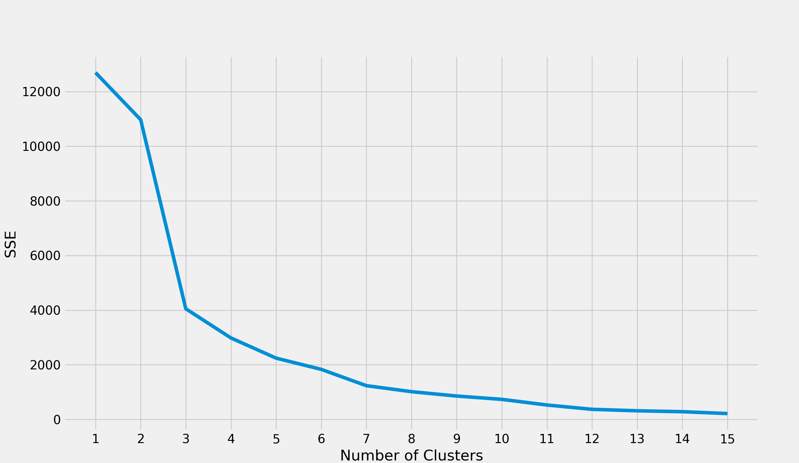</td>
	</tr>
	<tr>
		<td colspan="4">Inflection Point for Top 10: 4 clusters</td>
		<td colspan="4">Inflection Point for Top 5: 6 clusters</td>
	</tr>
	<tr>
		<td colspan="4">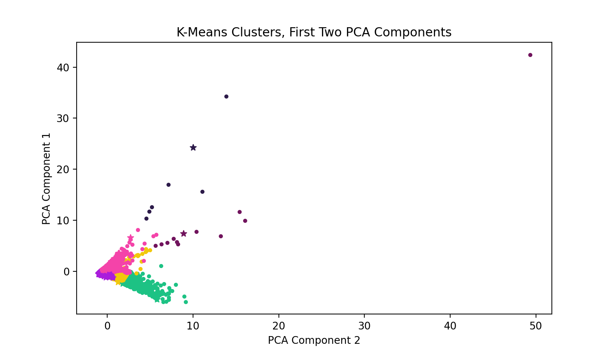</td>
		<td colspan="4">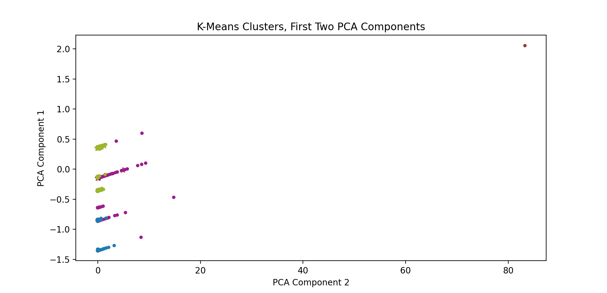</td> 
	</tr>
	<tr>
		<td>Cluster Number</td>
		<td>Number of CANDIDATES</td>
		<td>Number of FALSE POSITIVES </td>
		<td>Percent CANDIDATE Objects in Cluster</td>
		<td>Cluster Number</td>
		<td>Number of CANDIDATES</td>
		<td>Number of FALSE POSITIVES </td>
		<td>Percent CANDIDATE Objects in Cluster</td>
	</tr>
	<tr>
		<td> 0 </td> 
		<td> 42 </td> 
		<td> 1765 </td> 
		<td> 2% </td>
		<td> 0 </td>
		<td> 8 </td>
		<td> 495 </td>
		<td> 1.6% </td>
	</tr>
	<tr>
		<td> 1 </td>
		<td> 0 </td>
		<td> 1213 </td>
		<td> 0% </td>
		<td> 1 </td>
		<td> 46 </td>
		<td> 1129 </td>
		<td> 4% </td>
	</tr>
	<tr>
		<td> 2 </td>
		<td> 0 </td>
		<td> 1 </td>
		<td> 0% </td>
		<td> 2 </td>
		<td> 1 </td>
		<td> 11 </td>
		<td> 8% </td>
	</tr>
	<tr>
		<td> 3 </td>
		<td> 3987 </td>
		<td> 1350 </td>
		<td> 75% </td>
		<td> 3 </td>
		<td> 3820 </td>
		<td> 1082 </td>
		<td> 78% </td>
	</tr>
	<tr>
		<td></td>
		<td></td>
		<td></td>
		<td></td>
		<td> 4 </td>
		<td> 153 </td>
		<td> 1142 </td>
		<td> 12% </td>
	</tr>
	<tr>
		<td></td>
		<td></td>
		<td></td>
		<td></td>
		<td>5</td>
		<td>1</td>
		<td>6</td>
		<td>14%</td>
	</tr>
</table>

**Parameter Values:** Tuning K with Sillhouette Coefficient

The team further evaluated the value of K through silhoutte coefficients. For the top 5 features, the silhouette coefficient value decreased as the number of clusters increased. The opposite is the case for top 10 features. Based on this information, we selected K=2 for the top 5 features and K=15 for the top 10 features.

The model performed worse for where K = 2 but performed near perfectly where K=15 for the top 10 features. This could mean that the kmeans model will be prone to over-fitting or underfitting when using the silhouette coefficient to determine the number of clusters.

<table>
	<tr>
		<th colspan="4">Using Top 10 Features</th>
		<th colspan="4"> Using Top 5 Features</th>
	</tr>
	<tr>
		<td colspan="4"></td>
		<td colspan="4"></td>
	</tr>
	<tr>
		<td colspan="4"></td>
		<td colspan="4"></td>
	</tr>
	<tr>
		<td colspan="4">Silhoute Coefficent 0.93 where K = 15 clusters</td>
		<td colspan="4">Silhoute Coefficent 0.63 where K = 2</td>
	</tr>
	<tr>
		<td>Cluster Number</td>
		<td>Number of CANDIDATES</td>
		<td>Number of FALSE POSITIVES </td>
		<td>Percent CANDIDATE Objects in Cluster</td>
		<td>Cluster Number</td>
		<td>Number of CANDIDATES</td>
		<td>Number of FALSE POSITIVES </td>
		<td>Percent CANDIDATE Objects in Cluster</td>
	</tr>
	<tr>
		<td>0</td>
		<td>0</td>
		<td>1</td>
		<td>0%</td>
		<td>0</td>
		<td>42</td>
		<td>2094</td>
		<td>2%</td>
	</tr>
	<tr>
		<td>1</td>
		<td>0</td>
		<td>314</td>
		<td>0%</td>
		<td>1</td>
		<td>3987</td>
		<td>1871</td>
		<td>68%</td>
	</tr>
	<tr>
		<td>2</td>
		<td>0</td>
		<td>1</td>
		<td>0%</td>
		<td></td>
		<td></td>
		<td></td>
		<td></td>
	</tr>
	<tr>
		<td>3</td>
		<td>3987</td>
		<td>0</td>
		<td>100%</td>
		<td></td>
		<td></td>
		<td></td>
		<td></td>
	</tr>
	<tr>
		<td>4</td>
		<td>0</td>
		<td>115</td>
		<td>0%</td>
		<td></td>
		<td></td>
		<td></td>
		<td></td>
	</tr>
	<tr>
		<td>5</td>
		<td>0</td>
		<td>73</td>
		<td>0%</td>
		<td></td>
		<td></td>
		<td></td>
		<td></td>
	</tr>
	<tr>
		<td>6</td>
		<td>0</td>
		<td>5</td>
		<td>0%</td>
		<td></td>
		<td></td>
		<td></td>
		<td></td>
	</tr>
	<tr>
		<td>7</td>
		<td>0</td>
		<td>158</td>
		<td>0%</td>
		<td></td>
		<td></td>
		<td></td>
		<td></td>
	</tr>
	<tr>
		<td>8</td>
		<td>41</td>
		<td>1360</td>
		<td>3%</td>
		<td></td>
		<td></td>
		<td></td>
		<td></td>
	</tr>
	<tr>
		<td>9</td>
		<td>0</td>
		<td>602</td>
		<td>0%</td>
		<td></td>
		<td></td>
		<td></td>
		<td></td>
	</tr>
	<tr>
		<td>10</td>
		<td>0</td>
		<td>159</td>
		<td>0%</td>
		<td></td>
		<td></td>
		<td></td>
		<td></td>
	</tr>
	<tr>
		<td>11</td>
		<td>1</td>
		<td>31</td>
		<td>3%</td>
		<td></td>
		<td></td>
		<td></td>
		<td></td>
	</tr>
	<tr>
		<td>12</td>
		<td>0</td>
		<td>458</td>
		<td>0%</td>
		<td></td>
		<td></td>
		<td></td>
		<td></td>
	</tr>
	<tr>
		<td>13</td>
		<td>0</td>
		<td>321</td>
		<td>0%</td>
		<td></td>
		<td></td>
		<td></td>
		<td></td>
	</tr>
	<tr>
		<td>14</td>
		<td>0</td>
		<td>367</td>
		<td>0%</td>
		<td></td>
		<td></td>
		<td></td>
		<td></td>
	</tr>
</table>

<!---
#### Using Top 10 Features

**Parameter Values:** K clusters = 4 

| Cluster Number | Number of CANDIDATES | Number of FALSE POSITIVES | **Percent CANDIDATE Objects in Cluster** |
|---|---|---|---|
| 0 | 42 | 1765 | 2% |
| 1 | 0 | 1213 | 0% |
| 2 | 0 | 1| 0% |
| 3 | 3987 | 1350 | 75% |

#### Using Top 5 Features

**Parameter Values:** K clusters = 6

| Cluster Number | Number of CANDIDATES | Number of FALSE POSITIVES | **Percent CANDIDATE Objects in Cluster** |
|---|---|---|---|
| 0 | 8 | 495 | 1.6% |
| 1 | 46 | 1129 | 4% |
| 2 | 1| 11 | 8% |
| 3 | 3820 | 1082 | 78% |
| 4 | 153 | 1142 | 2.5% |
| 5 | 1 | 6 | 14% |

--->

## Gaussian Mixture Modeling
### Result
  The team found that, using the Gaussian Mixture Model, that 2 clusters was the ideal way to classify potential exoplanets with our chosen features. See below for two GIFs (5/10 feature clustering) of the first two PCA columns being assigned to various clusters for a brief understanding of how our algorithm works:

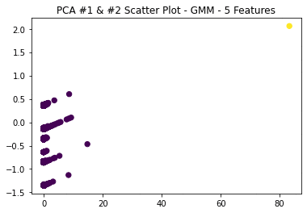

However, we used the AIC/BIC criterion to determine the best number of clusters to use. Below is a graph comparing number of clusters to criterion number, with the “elbow/best #” highlighted. Both 5 and 10 features are displayed for reference:

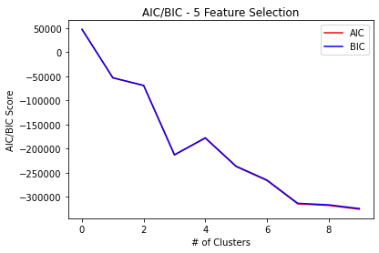

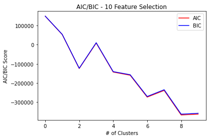

As the above figure highlights, 2 clusters is approximately when the AIC/BIC begins indicating 2 clusters is ideal for the 10 feature model and 3 is appropriate for the 5 feature model. Below is the figure displaying the model with just two clusters. :

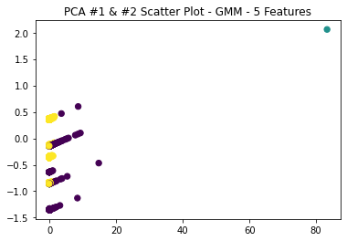

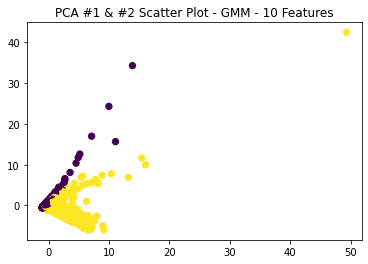

## Hierarchical Clustering
### Result
Below is the constructed dendrogram on our scaled dataset using a ward linkage for both our top five most important features and top 10 most important features. Using top five features:

Now, using top 10 features:

As mentioned briefly in the methods section, we decided to determine the optimal number of clusters by calculating the silhouette score for clustering from six to 25 clusters. Here is a graphical representation of those scores for each of our clusters. First for the five-feature dataset:

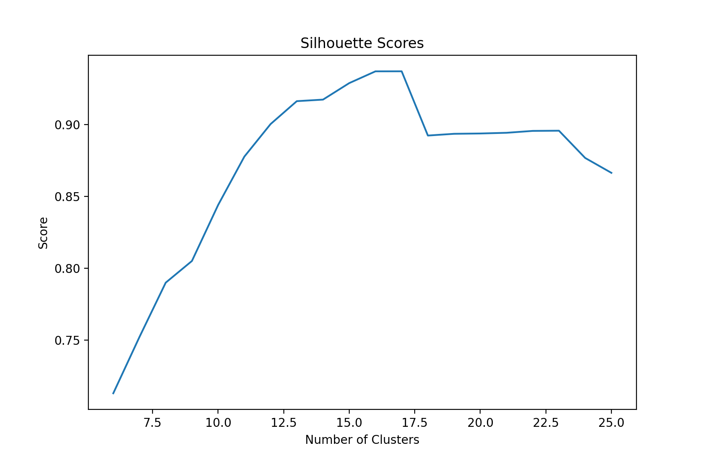

And the 10-feature dataset:

By locating the maximum silhouette score for each dataset, we determine that our optimal number of clusters is 17 for our top five features with a silhouette score of 0.937 and 11 for our top 10 features with a silhouette score of 0.309. We can then move to reducing our datasets to two principal components using PCA so that we can graphically represent our clustering. Below is the result of our PCA analysis. First is the graph for our top five dataset:

And top 10:

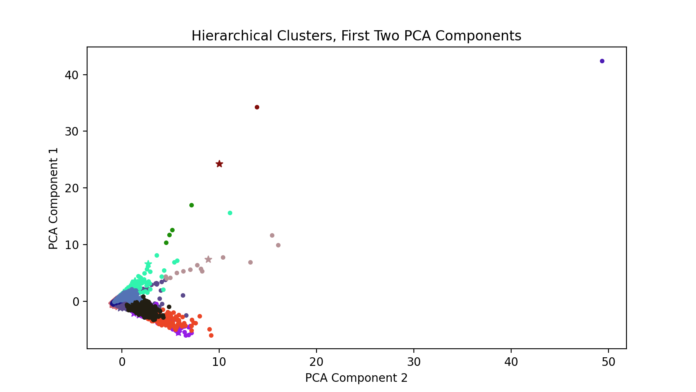

Lastly, we can directly calculate the number of candidate and false positive exoplanets in each of our clusters. Below is the tabular representation of this breakup for the top five features:

| Cluster Number | Number of CANDIDATES | Number of FALSE POSITIVES | **Percent CANDIDATE Objects in Cluster** |
|---|---|---|---|
| 0 | 41 | 1342 | 0.03% |
| 1 | 0 | 596 | 0% |
| 2 | 0 | 49 | 0% |
| 3 | 0 | 458 | 0% |
| 4 | 3987 | 0 | 100% |
| 5 | 0 | 162 | 0% |
| 6 | 1 | 17 | 0.056% |
| 7 | 0 | 105 | 0% |
| 8 | 0 | 313 | 0% |
| 9 | 0 | 5 | 0% |
| 10 | 0 | 312 | 0% |
| 11 | 0 | 366 | 0% |
| 12 | 0 | 113 | 0% |
| 13 | 0 | 53 | 0% |
| 14 | 0 | 72 | 0% |
| 15 | 0 | 1 | 0% |
| 16 | 0 | 1 | 0% |

For the top 10 features dataset:

| Cluster Number | Number of CANDIDATES | Number of FALSE POSITIVES | **Percent CANDIDATE Objects in Cluster** |
|---|---|---|---|
| 0 | 24 | 1735 | 0.014% |
| 1 | 56 | 924 | 0.057% |
| 2 | 3910 | 480 | 0.891% |
| 3 | 10 | 113 | 0.081% |
| 4 | 0 | 170 | 0% |
| 5 | 0 | 1 | 0% |
| 6 | 24 | 218 | 0.099% |
| 7 | 1 | 1 | 0.5% |
| 8 | 0 | 4 | 0% |
| 9 | 1 | 13 | 0.071% |
| 10 | 3 | 306 | 0.010% |

For both datasets, we have a cluster that returns a majority of candidate exoplanets. Regarding the top five dataset, cluster four contains 3987 candidate planets and no false positives, while the top 10 dataset's cluster two contains 3910 candidate planents and only 480 false positives. 

## DBSCAN
### Result
Results are presented for both the Top 10 features dataset and the Top 5 features dataset. Even though the tuned parameters were different, the results were strikingly similar.
#### Using Top 10 Features
**Parameter Values:** &epsilon; = 1, min_samples = 15

**Silhouette Coefficient:** = 0.250

As seen in the other clustering algorithms, DBSCAN settled on a solution where the majority of the CANDIDATE planets are located in one cluster, with a sprinkle in another cluster, where they only make up 0.03% of the cluster data. This phenomenon will be further explained in the Discussion section. Only 7,621 data points are accounted for in this cluster spread, a difference of over 300 from the 7,995 data points passed in. This is mostly likely due to the fact that outliers found by DBSCAN will not be linked to a cluster. If sections of points do not meet the minimum sample requirement to be designated as a cluster, or are too far from other data points to be within &epsilon; distance of others, the data point will be an outlier and not counted in a cluster.

| Cluster | Number of CANDIDATES | Number of FALSE POSITIVES | **Percent CANDIDATE Objects in Cluster** |
|---|---|---|---|
| 0 | 3967 | 0 | 100% |
| 1 | 39 | 1213 | 0.03% |
| 2 | 0 | 298 | 0% |
| 3 | 0 | 306 | 0% |
| 4 | 0 | 449 | 0% |
| 5 | 0 | 525 | 0% |
| 6 | 0 | 103 | 0% |
| 7 | 0 | 360 | 0% |
| 8 | 0 | 153 | 0% |
| 9 | 0 | 63 | 0% |
| 10 | 0 | 104 | 0% |
| 11 | 0 | 41 | 0% |

The plot visualizing the clusters and their makeup is below. Many of the clusters seem to be overlapping, but we can most likely attribute that to some other dimension that we just cannot visualize accurately. You can see the sage green cluster that holds many of the star-shaped points and therefore where the majority of the CANDIDATE points lie. You can also pick out a few star shapes in the bright blue cluster, which are relatively close to the sage green star-shapes, which makes sense.

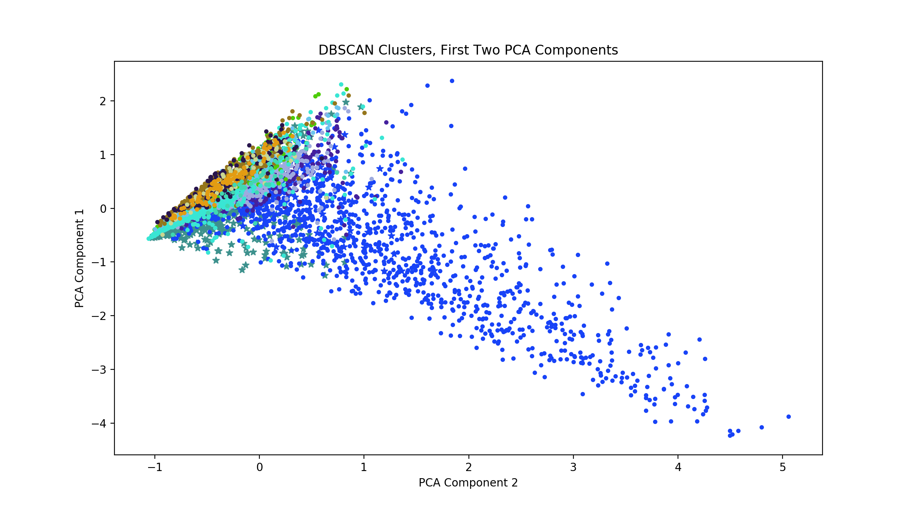

The silhouette coefficient for the 10 feature dataset is relatively low - 0.250. It is much lower than the 5 feature dataset, which has a very similar cluster spread as seen below. This could be due to the over 300 outliers that are not accounted for in the cluster distribution.

#### Using Top 5 Features
**Parameter Values:** &epsilon; = 0.5, min_samples = 6

**Silhouette Coefficient:** = 0.928

The distribution of CANDIDATE objects in each cluster is extremely similar to the 10 feature dataset, even comparing the percentages of CANDIDATE Objects in the clusters. However, the 5 feature model accounts for almost all of the data points passed in, with a total of 7,962 data points. This leaves this model with only about 30 outliers, a mere 10% of the outliers detected in the 10 feature model.

| Cluster | Number of CANDIDATES | Number of FALSE POSITIVES | **Percent CANDIDATE Objects in Cluster** |
|---|---|---|---|
| 0 | 3986 | 0 | 100% |
| 1 | 41 | 1377 | 0.03% |
| 2 | 0 | 314 | 0% |
| 3 | 0 | 322 | 0% |
| 4 | 0 | 458 | 0% |
| 5 | 0 | 601 | 0% |
| 6 | 0 | 113 | 0% |
| 7 | 0 | 366 | 0% |
| 8 | 0 | 155 | 0% |
| 9 | 0 | 72 | 0% |
| 10 | 0 | 105 | 0% |
| 11 | 0 | 52 | 0% |

The plot visualizing the clusters and their distribution is below. It looks remarkably different than the 10 feature dataset. The distances between each cluster or group of clusters are much more plainly seen. Some of the clusters are still overlapping, which tells us there is most likely more dimensions that factor into the clustering that we cannot see.  
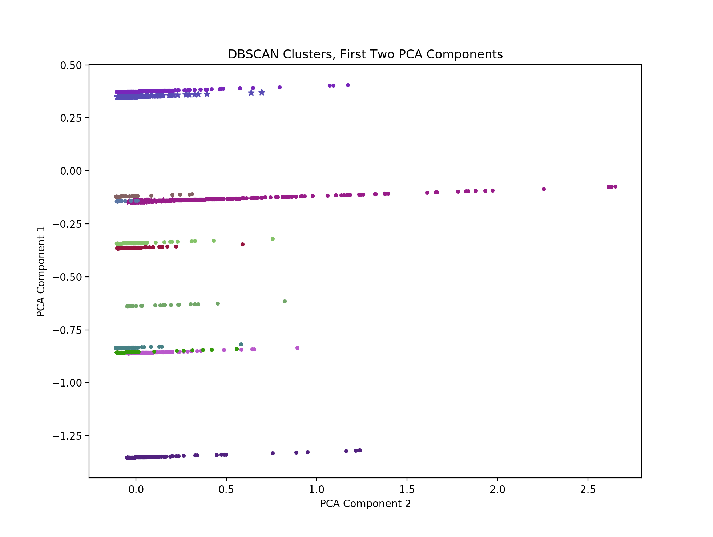

The silhouette coefficient for the 5 feature model is much higher than the 10 feature model, which we hypothesize is attributed to the lower amount of outliers, and more even distribution of FALSE POSITIVE objects.

# Results - Classification
After performing all of our clustering algorithms, we needed to determine which clustering algorithm's labels to move forward with, as well as decide the number of features to include. The CANDIDATE points in K-means and hierarchical clustering are more evenly distributed over multiple clusters compared to the more contained results of DBSCAN. Because the CANDIDATE points are centralized in only two clusters in DBSCAN, the cluster label will likely be more meaningful in the classification process, and does not seem to be at risk for overfitting. Thus, for all of the classification methods implemented, the input was a dataset including the top five most important features and the DBSCAN cluster label for the data point. Also, to ensure that the models were being assessed equally, we used the same train/test data split for each model. 25% of the data was reserved for testing, while the other 75% was used for training.

## Decision Trees
Because we implemented two ensemble decision tree algorithms, we will address their results separately. For both GradientBoostingClassifier and XGBoost, the best parameter combination detected by grid search was a learning rate equal to 0.01, and 100 boosting stages. The model performances for both of the gradient boosted decision trees are essentially equivalent, for every measurement. This is most likely due to the similarity in their gradient boosting algorithms under the hood. There also may not be enough data points for XGBoost's regularization to make much of a difference.

### GradientBoostingClassifier
The confusion matrix with the results of GradientBoostingClassifier's predictions for the test set is below. 
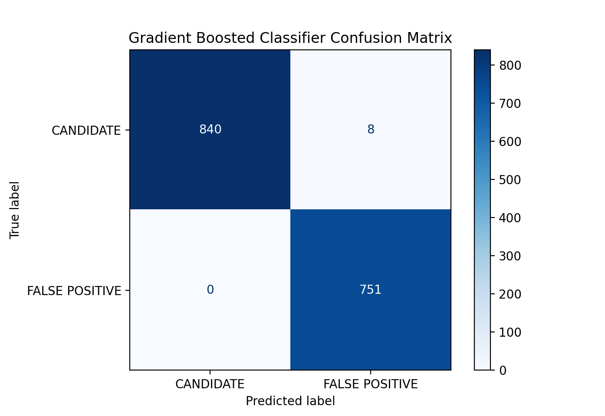

**Accuracy:** 99%

**Precision:** 100%

**Recall:**  99%

**Sensitivity:** 99%

**Specificity:** 100%

**F1 Score:** 1

The model performs extremely well on the test set. Nearly all of the data points were classified correctly, excluding only eight. Unfortunately, the eight data points that are misclassified are false negatives, meaning that they are actually CANDIDATE points that were classified as FALSE POSITIVES. This is not an ideal scenario, because it indicates that our model would miss actual exoplanets. However, the false negatives constitute less than 0.01% of the test CANDIDATE population, which is an acceptable percentage. Overall, we would be confident using this model, and it is more robust than regular decision trees.

### XGBoost
The confusion matrix with the results of XGBoost's predictions for the test set is below. 
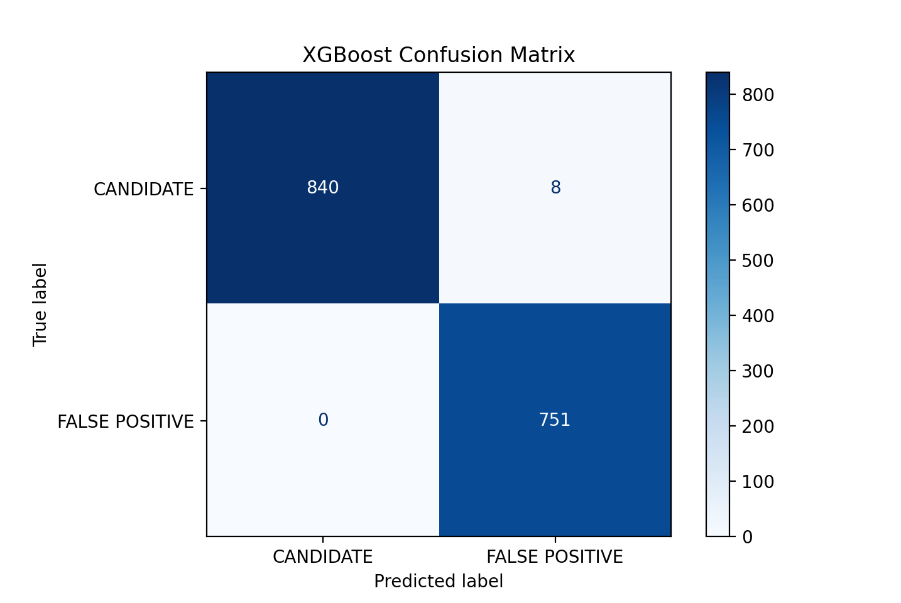

**Accuracy:** 99%

**Precision:** 100%

**Recall:**  99%

**Sensitivity:** 99%

**Specificity:** 100%

**F1 Score:** 1

By our observations, the model performs extremely well on the test set. Nearly all of the data points were classified correctly, also excluding only eight samples like the GradientBoostingClassifier. Once again, the eight data points misclassified are false negatives; the issues of which were addressed above. Like the GradientBoostingClassifier, we would be confident implementing this model as a part of our ML design pipeline. We would probably lean towards choosing XGBoost between the two for long term maintenance. If we were to rerun our models with a larger dataset, XGBoost would be more equipped to handle the larger dataset due to its optimization techniques under the hood.

## Logistic Regression
Implementing the threshold / confidence value of logistic regression is more of an art than a technical process like the grid search mentioned in the gradient boosted decision tree process. We want to minimize false negatives, which would cause us to miss out on possible exoplanet candidates. Thus, we would choose a lower threshold that would then classify more planets as exoplanets than there actually are; this process would still cut down on the workload of NASA scientists classifying exoplanets while giving them a tool to help them focus their efforts.  The results for the hard classification using a threshold of 0.5 are below. 

**Accuracy:** 99%

**Precision:** 100%

**Recall:**  99%

**Sensitivity:** 99%

**Specificity:** 100%

**F1 Score:** 1

Logistic regression presented results parallel to the other supervised models the team had worked to create. While accuracy and precision scored very well, the model also managed to score higher on the false negative criterion. As aforementioned, we are prioritizing minimizing false negatives, and logistic regression performs comparably. For real world application, it may be better to return the probabilities rather than the hard classification results, but hard classification allowed us to compare logistic regression to other models.

## Naive Bayes
The confusion matrix for our Gaussian Naive Bayes model's predctions on the test set is below.
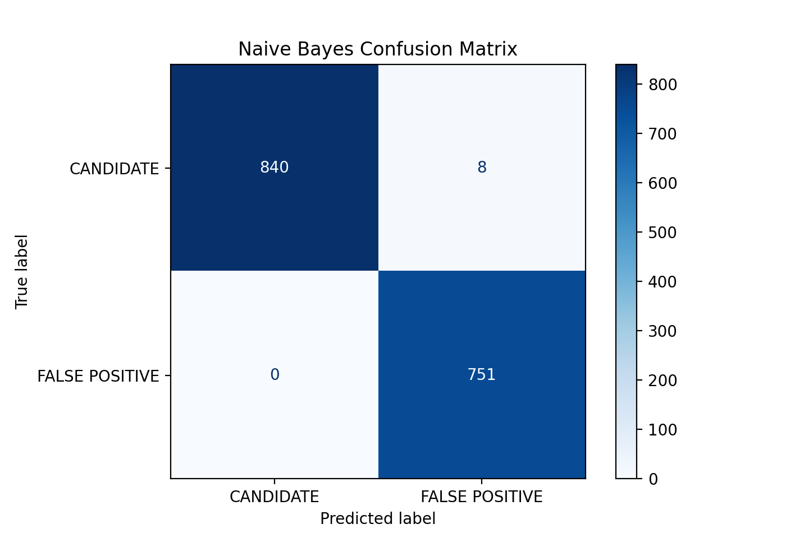

**Accuracy:** 99%

**Precision:** 100%

**Recall:**  99%

**Sensitivity:** 99%

**Specificity:** 100%

**F1 Score:** 1

Using this implementation, it appears we receive identical results on the test set compared to both decision tree models. Like those models, we have only eight misclassifications, all of them being false negatives (they are CANDIDATE points that are wrongly classified as FALSE POSITIVES). Specific drawbacks were mentioned previously, that it's particularly disadvantageous to have these false negative misclassifications, since we may be missing actual exoplanets. Like the other models, though, these misclassifications constitute such a small proportion of the test CANDIDATE population that we could remain confident in the findings of this model. 

# Discussion
## Clustering Results: What We've Learned About the Data
As we've seen from our clustering results, most of the clustering algorithms converged on a solution that ended up with one cluster holding almost all of the candidate points, then one or two clusters holding a much smaller amount. We found this very interesting so decided to look into the makeup of the objects that were apart of those two clusters. We will use the DBSCAN model run on the 5 feature dataset as an example, as that is the algorithm and subsequent data that we chose to move forward with. For this model, clusters 0 and 1 hold all (or almost all) of the candidate points in the dataset. A table with statistics for these two clusters is below.

| Cluster | Average koi_fpflag_co Value | Average koi_fpflag_nt Value | Average koi_fpflag_ss Value | Average koi_fpflag_ec Value | Average koi_prad Value |
|---|---|---|---|---|---|
| 0 | 0 | 0 | 0 | 0 | 3.761 |
| 1 | 0 | 0 | 1 | 0 | 69.419 |

Interestingly enough, for cluster 0, all of the binary flags were equal to 0. For cluster 1, koi_fpflag_ss was equal to 1. There is also a significant difference between the koi_prad values. These are important statistics to be aware of because they paint a clearer picture on how NASA actually classifies exoplanets, without us ever needing to know the specific astronomical requirements. 

## Comparing Classification Model Results

| Metric | GradientBoostingClassifier | XGBoost | Logistic Regression | Naive Bayes |
|---|---|---|---|---|
| Accuracy | 99% | 99% | 99% | 99% |
| Recall | 100% | 100% | 99% | 100% |
| Precision | 99% | 99% | 100% | 99% |
| Sensitivity | 99% | 99% | 99% | 99% |
| Specificity | 100% | 100% | ~100% | 100% |
| F1 Score | 1 | 1 | 0.99 | 1 |

Ideally, there would be minimal false negatives, because we don't want to miss any possible CANDIDATE planets. As expected, all of our models predicted some false negatives, but they constituted less than 0.01% of the test set. By and large, the models performed extremely well and almost equivalent. Then, how do we choose which model to move forward with?

GradientBoostingClassifier, XGBoost, and Naive Bayes are all hard classifiers, which by definition output the predicted class (CANDIDATE, FALSE POSITIVE), not the probability of the data point belonging to that class. Logistic Regression is a soft classifier, which outputs the probability that the data point belongs to the specific class. For the purposes of this project and the nature of scientific classification, a soft classifier most likely suits the needs of the problem more than a hard classifier. A soft classifier enables the planetary experts to set confidence thresholds for classification, which is preferable to just classifying an object as a CANDIDATE or FALSE POSITIVE with no nuance. Perhaps if we examined the misclassifications in Logistic Regression, the probabilities may indicate to experts that the data point requires more inspection for definitive classification.

Before starting this project, all team members were relatively unfamiliar with the details of classification models. With the knowledge we have gained in the class and in the course of this project, we now believe that the soft classification approach should have been our sole classification approach. There are many soft classification models that we did not implement for this project that may have been better suited to the problem. However, our hard classification models performed equivalently to Logistic Regression, so not much information has been lost between the two in the scope of this project.

# Conclusion
Our model design classified Kepler's objects of interest extremely well, with an accuracy of 99%. We tested four clustering models: K-Means, Gaussian Mixture Modeling, Hierarchical Clustering, and DBSCAN. DBSCAN provided the most holistic cluster labels while minimizing overfitting that may have been prevalent with the other models. The cluster labels based on the top 5 most important features identified by Random Forest. These in turn utilized as a feature for the classification models we tested. This is a similar process to some text classification methods, which was a key influence in our decision to follow this path. 

The classification models we tested were Gradient Boosted Decision Trees, Logistic Regression, and Naive Bayes. With all of these models, Gradient Boosted Decision Trees and Naive Bayes were hard classifiers and Logistic Regression was a soft classifier. While the hard classifiers gave a definitive classification and performed marginally better (a one data point difference), Logistic Regression could provide both the classification and the probability that a point belonged to that class. Due to the nature of this problem and the fact that we want to minimize false negatives, a soft classification method would provide more information for NASA's scientists identifying the exoplanets because then the experts could set a confidence threshold that could adapt to new information. Thus, we chose to include Logistic Regression as the classification component of our final model. 

As with any model, it may need updates as more data is available. There is also the possibility that NASA will modify their definition of what an exoplanet is and new classifications would reflect that. Thus, we would need to rerun our models on the new / updated data. This would most likely not be very often, but we believe our model is robust enough to handle changing data. 
