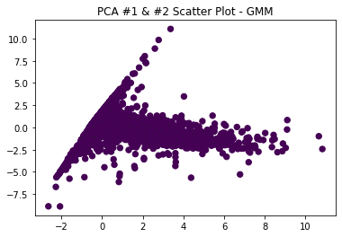

# Introduction/Background
-(MICAELA) pull from proposal

# Problem definition
-(MICAELA) pull from proposal

# Data Collection
-(MICAELA) pull from proposal

## Exoplanet Dataset
The dataset was sourced from Kaggle, linked [here](https://www.kaggle.com/nasa/kepler-exoplanet-search-results), sourced directly from NASA. The inital size was 3.52 MB, with 50 columns and around 10,000 data points. Each data point contains information about physical characteristics of already classified objects identified by Kepler; the data point also has a label (koi_pdisposition) designating it as either a CANDIDATE or a FALSE POSITVE. Our goal is to identify CANDIDATE planets.

Thankfully the dataset came with a thorough data dictionary, linked [here](https://exoplanetarchive.ipac.caltech.edu/docs/API_kepcandidate_columns.html). Our goal was to use the possible exoplanet's physical characteristics to identify the object of interest as either a candidate or false positive, so we we focused mostly on the physical characteristics columns. More information about feature selection is below.

## Data Cleaning and Preparation
This dataset was relatively easy to clean-there was no aggregation to be done or significant issues to handle. The main issues were NaN values and feature selection.

### Cleaning
Before dropping any columns, 36 columns contained at least some NaN values. This obviously was not going to be helpful for our purposes, but we didn't necessarily want to just drop all 36 columns. We first removed essentially all columns that weren't physical characteristics of the object of interest, excepting the label koi_pdisposition. This includes the exoplanet's id and name(s).

**Note:** The columns koi_pdispostion and koi_disposition are very similar. koi_disposition values are "the category of this KOI from the Exoplanet Archive", which includes CONFIRMED planets that have been verified manually by NASA. koi_pdisposition values are "the pipeline flag that designates the most probable physical explanation of the KOI". koi_pdisposition is therefore a better fit for our purposes, because we want to decrease the manual labor of NASA to identify candidate exoplanets and thus want to rely on the physical explanations rather than whether the object of interest is CONFIRMED in the Exoplanet Archive.

After dropping the categorical columns, we still had the NaN problem. There were two columns, koi_teq_err1 and koi_teq_err2 that had no values for any data points, so those were dropped. Then, we reached a spot in our data cleaning process where some decisions had to be made. Most of the continuous columns had err1 and err2 values, which were essentially the confidence interval range for the actual value measured for the column. For example, if koi_depth was 2, err1 could be 1, and err2 could be -0.5, telling us that the actual bounds for koi_depth were between [1.5, 3]. We considered having different columns for upper and lower bounds, but didn't see that the information added by that would be exceedingly helpful. Because of this we chose to essentially ignore all of the error columns and keep the measured values. After doing this, we removed the data points that still contained NaN values. We decided to not impute the missing values due to the variation between the physical characteristics of all of the data points.

Cleaning the data of NaN values and unnecessary columns reduced our dataset to 22 columns and nearly 8000 data points. 8000 data points is plenty to use for our purposes. 

**Note:** The feature koi_score was not removed during the cleaning process, but we chose to not include it in our final list of features. The definition of this 
feature is "a value between 0 and 1 that indicates the confidence in the KOI disposition. For CANDIDATEs, a higher value indicates more confidence in its disposition, while for FALSE POSITIVEs, a higher value indicates less confidence in that disposition. The value is calculated from a Monte Carlo technique such that the score's value is equivalent to the frction of iterations where the Robovetter yields a disposition of CANDIDATE." Thus, the koi_score is directly linked to the koi_pdisposition of the data point, our target variable, using complex mathmatical methods. Because of this direct correlation, and the fact that it is not a physical characteristc of the exoplanet, we have chosen to disregard it from consideration for features.

### Feature Selection Methods
#### Visualizing the Pearson Correlation Coefficient Between Pairs of Features
After cleaning the dataset, we were left with 22 features. Since we are focusing on physical characteristics, it is very probable that there are highly correlated variables. We checked this by visualizing the Pearson correlation between each feature. The Pearson correlation coefficient values are between +1 and -1; +1 denotes a strong positive correlation while -1 denotes a strong negative correlation. Using the python visualization library seaborn, we created a heatmap illustrating the Pearson correlation between each variable. 

As seen in the Pearson correlation, we have a few semi-correlated features, seen by the darker red and blue colors in the heatmap. However, most of the features are not highly correlated, if at all.

#### Random Forest to Determine Feature Importance
Since we are not considering koi_score (see note above) we are left with 21 features for each data point. It is very likely that most of these features are not necessarily significant for actually predicting the label of the data point. Random Forest is a very popular method to determine feature importance. The model accomplishes this by creating many decision trees, and determining where the splits in those decision trees should optimally be, on which features by maximizing the information gain at each split. By doing this, the Random Forest algorithm can rank the features based on the average information gain of the feature. We plotted the ten most important features found by Random Forest.

The features and their definitions are in the table below. 

| Feature | Definition  |
|---|---|
| koi_fpflag_ss | Stellar Eclipse Flag: A KOI that is observed to have a significant secondary event, transit shape, or out-of-eclipse variability, which indicates that the transit-like event is most likely caused by an eclipsing binary. |
| koi_fpflag_co | Centroid Offset Flag: The source of the signal is from a nearby star, as inferred by measuring the centroid location of the image both in and out of transit, or by the strength of the transit signal in the target's outer (halo) pixels as compared to the transit signal from the pixels in the optimal (or core) aperture. |
| koi_fpflag_nt | Not Transit-Like Flag: A KOI whose light curve is not consistent with that of a transiting planet. This includes, but is not limited to, instrumental artifacts, non-eclipsing variable stars, and spurious (very low SNR) detections. |
| koi_fpflag_ec | Ephemeris Match Indicates Contamination Flag: The KOI shares the same period and epoch as another object and is judged to be the result of flux contamination in the aperture or electronic crosstalk.  |
| koi_prad | Planetary Radius (Earth radii): The radius of the planet. Planetary radius is the product of the planet star radius ratio and the stellar radius. |
| koi_depth | Transit Depth (parts per million): The fraction of stellar flux lost at the minimum of the planetary transit. Transit depths are typically computed from a best-fit model produced by a Mandel-Agol (2002) model fit to a multi-quarter Kepler light curve, assuming a linear orbital ephemeris. |
| koi_insol | Insolation Flux [Earth flux]: Insolation flux is another way to give the equilibrium temperature. It depends on the stellar parameters (specifically the stellar radius and temperature), and on the semi-major axis of the planet. It's given in units relative to those measured for the Earth from the Sun. |
| koi_teq | Equilibrium Temperature (Kelvin): Approximation for the temperature of the planet. The calculation of equilibrium temperature assumes a) thermodynamic equilibrium between the incident stellar flux and the radiated heat from the planet, b) a Bond albedo (the fraction of total power incident upon the planet scattered back into space) of 0.3, c) the planet and star are blackbodies, and d) the heat is evenly distributed between the day and night sides of the planet. |
| koi_period | Orbital Period (days): The interval between consecutive planetary transits. |
| koi_model_snr | Transit Signal-to-Noise: Transit depth normalized by the mean uncertainty in the flux during the transits. |

By just taking the top ten features, we cut our number of features in half. However, five of the ten features have an importance below 0.05, which can generally be classified as "low". However, we cannot know for sure, and our manual cost of trying both the datasets with the top ten features and only the top five features is very low, so we implemented both datasets in the unsupervised learning methods below.  

# Methods
call out features of clusters that indicate candidates (process and describe some math, Why)
## Unsupervised
### K-means
### Gaussian Mixture Modeling
Gaussian Mixture Modeling results on the exoplanets data still required some data preparation before final results could be interpreted. The primary method the team used to analyze results with GMM was to normalize all non-binary data using StandardScaler(). Once we concatenated all of the team’s data back together, the team then generated a scipy GMM model with the normalized data.
	
From this model the team was able to generate predicted labels and probabilities for different numbers of clusters. The team was also able to visualize the clusters utilizing PCA. Since we cannot visualize more than three dimensions, and only two easily, the team then used the first two PCA vectors for visualizing the different cluster assignments. All results generated by the team are displayed in the results section for GMM.
	
In order to evaluate quality of a model’s fit the team used two techniques. The first method was to compare our predicted labels to the true labels provided by the kepler dataset. This provided a simple standard error percentage we could use to determine the effectiveness of our algorithm. The team opted to not use the sum of the squares ANOVA method because it would prove to yield the same results as our previous method due to the nature of the binary prediction. The second method the team used to determine the best model/best number of clusters was with the AIC & BIC selection criterion. Graphs comparison the AIC/BIC to number of clusters are shown in the results section of GMM. The “best” model was selected on the elbow of the AIC/BIC graph.

### Hierarchical Clustering
### DBSCAN

## Supervised
### TODO: Steps Moving Forward

# Results
--silhouette coefficient 
--number of cluster
--number of candidate / false positive exoplanets in each cluster
## K-means
### Result
## Gaussian Mixture Modeling
  The team found that, using the Gaussian Mixture Model, that 2 clusters was the ideal way to classify potential exoplanets with our chosen features. See below for a GIF of the first two PCA columns being assigned to various clusters for a brief understanding of how our algorithm works:

### Result
## Hierarchical Clustering
### Result
## DBSCAN
### Result

# Discussion
-(MICAELA)flow chart
-talk about determining uncertainty 
-we don't yet have error
